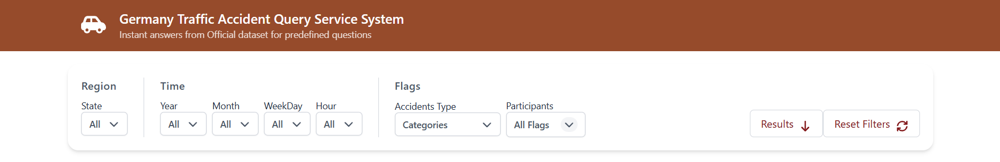
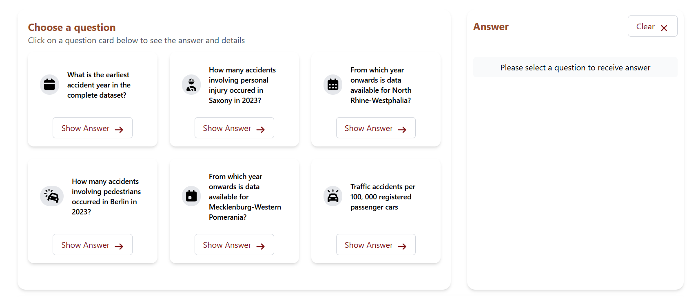
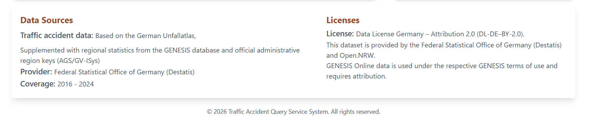

# Germany Traffic Accident Query Service System

## 1. Project Overview

This project is a full-stack web application for exploring and analyzing traffic accident data in Germany. It combines official German open datasets from Unfallatlas, GENESIS, and the German Municipality Directory (GV-ISys) to provide accident statistics, regional filtering, and risk indicators.

The application allows users to:

- Explore traffic accidents by region and time period.
- Filter accidents by state, municipality, month, weekday, hour, category, and participant type.
- Retrieve metadata about dataset availability.
- Compare accident risk across regions using registered vehicle statistics.
- Analyze accidents in relation to population and vehicle ownership.

The system consists of:

- React frontend
- Express.js REST API
- MongoDB database
- Automated data import scripts

---

# 2. Technologies Used

## Frontend

- React
- Axios
- Tailwind CSS
- Headless UI
- Font Awesome

## Backend

- Node.js
- Express.js
- Mongoose

## Database

- MongoDB

## Development Environment

Minimum Requirements:

- Node.js 18+
- MongoDB 7+
- Modern Web Browser
  - Chrome 120+
  - Firefox 120+
  - Edge 120+

The application has been developed and tested on Windows 11.

---

# 3. Data Sources

The project uses official German open data.

## 1. Unfallatlas

Source:

https://www.opengeodata.nrw.de/produkte/transport_verkehr/unfallatlas/

Purpose:

- Traffic accident records
- Accident categories
- Participant information
- Time information
- Geographic coordinates

Imported into:

- accidents collection

---

## 2. GENESIS Population Statistics

Source:

https://www-genesis.destatis.de/datenbank/online

Dataset:

12411-0015

Purpose:

- Population by region

Imported into:

- indicators collection
- indicatorValues collection

Indicator:

Population

---

## 3. GENESIS Vehicle Statistics

Source:

https://www-genesis.destatis.de/datenbank/online

Dataset:

46251-0021

Purpose:

- Registered passenger cars

Imported into:

- indicators collection
- indicatorValues collection

Indicator:

Passenger Cars

---

## 4. German Municipality Directory (GV-ISys)

Source:

https://www.destatis.de/DE/Themen/Laender-Regionen/Regionales/Gemeindeverzeichnis/

Purpose:

- Administrative regions
- AGS codes
- State information
- Municipalities
- Districts

Imported into:

- regions collection

---

# 4. Database Structure

The database consists of five collections.

## Regions

Stores German administrative regions.

Fields:

- region_id
- parent_region_id
- ags
- state_name
- name
- level
- population
- geometry

Administrative levels:

- municipality
- district
- office
- other

---

## Accidents

Stores imported Unfallatlas accident records.

Fields:

- accident_id
- region_id
- ags
- year
- month
- hour
- weekday
- category
- type
- light
- participants
- lon
- lat

---

## Indicators

Stores metadata about imported indicators.

Examples:

- Population
- Passenger Cars

Fields:

- indicator_id
- code
- name
- unit
- source_system

---

## Indicator Values

Stores regional indicator values.

Fields:

- region_id
- indicator_id
- year
- value

Example:

Population of a state in 2022.

---

## Import Runs

Stores import history.

Fields:

- source
- importDate
- recordsImported
- version
- status
- durationMs
- error

Purpose:

- Audit imports
- Track failures
- Record dataset versions

---

# 5. Data Import

The database itself is not submitted.

Instead, import scripts are provided.

The following scripts must be executed before starting the application.

## Import Regions

```javascript
await runAgsImport();
```

Imports:

- States
- Districts
- Municipalities
- AGS codes

---

## Import Population Statistics

```javascript
await runGenesisImport({
  filepath: "./data/12411-0015_en.xlsx",
  parser: populationParser,
});
```

Imports:

- Population indicator values

---

## Import Passenger Car Statistics

```javascript
await runGenesisImport({
  filepath: "./data/46251-0021_en.xlsx",
  parser: carsParser,
});
```

Imports:

- Registered passenger cars

---

## Import Accident Data

```javascript
await runUnfallatlasImport();
```

Imports:

- Traffic accidents
- Participants
- Coordinates
- Time information

---

# 6. REST API

## Metadata

### Earliest Available Year

GET

```text
/api/meta/earliest-year
```

Returns:

- First available accident year

---

### Region Availability

GET

```text
/api/meta/region/:state
```

Returns:

- Available years for a specific state

---

## Accident Queries

### Accident Count

GET

```text
/api/accidents/count
```

Supported parameters:

- state_name
- year
- month
- hour
- weekday
- category
- participants

Example:

```text
/api/accidents/count?state_name=Sachsen&year=2023
```

---

### District Ranking

GET

/api/accidents/rankings

Returns:

Five districts with the highest number of fatal accidents
Accident counts per district
Ranking information

---

### Municipalities with Zero Accidents

GET

/api/accidents/municipalityAccident

Parameters:

state_name
year

### Bicycle Accident Count

GET

/api/accidents/bicycleCount

Parameters:

year
participant

---

## Analysis

### Accidents per 100,000 Cars

GET

```text
/api/analysis/accidents-per-100k-cars
```

Combines:

- Accident data
- Passenger car statistics

This endpoint satisfies the requirement of using multiple datasets.

---

## Filters

### States

```text
/api/filters/states
```

### Years

```text
/api/filters/years
```

### Months

```text
/api/filters/month
```

### Weekdays

```text
/api/filters/weekday
```

### Hours

```text
/api/filters/hours
```

### Categories

```text
/api/filters/categories
```

### Participants

```text
/api/filters/participants
```

### Filtered Accident Count

```text
/api/filters/count
```

---

# 7. Architecture

Data Flow:

Datasets
↓
Import Scripts
↓
MongoDB
↓
Express REST API
↓
React Frontend

The frontend never accesses the database directly.

All database interactions are performed through the REST API.

---

# 8. Mandatory and Additional Questions Supported

The application supports both the mandatory assignment questions and additional analytical queries.

## Mandatory Questions

The system can answer:

How many accidents occurred in a selected region?
How many accidents occurred during a specific year?
Which accident categories exist?
Which participant groups were involved?
Which years are available for a specific region?
Additional Questions

The following custom analytical questions were implemented:

## Question 1

Which five districts recorded the highest number of fatal accidents in Germany during 2024?

### Datasets used:

Unfallatlas
GV-ISys

### Method:

Fatal accidents are filtered from Unfallatlas records.
Municipality AGS codes are aggregated to district-level AGS codes.
Results are ranked by accident count.

## Question 2

How many bicycle accidents occurred in Dresden during 2024?

### Datasets used:

Unfallatlas
GV-ISys

### Method:

Municipality AGS is resolved from GV-ISys.
Accident records are filtered by year and participant type.

## Question 3

Which municipalities in Saxony recorded zero reported accidents during 2023?

### Datasets used:

Unfallatlas
GV-ISys

### Method:

All municipalities in Saxony are retrieved.
Municipalities appearing in accident records are identified.
Municipalities without accident records are returned.

## Cross-Dataset Analysis

Which regions have the highest accident risk relative to vehicle ownership?

### Datasets used:

Unfallatlas
GENESIS Population
GENESIS Passenger Cars
GV-ISys

### Method:

- Accident counts are combined with registered passenger-car statistics.
- Accident rates per 100,000 registered vehicles are calculated.

---

# 9. Data Integration Strategy

The application integrates multiple official datasets using the German AGS administrative identifier.

## AGS-based Linking

All datasets are linked through AGS (Amtlicher Gemeindeschlüssel) codes.

Examples:

Accident records contain AGS identifiers.
Regions contain AGS identifiers.
Indicator values reference regions through region identifiers derived from AGS mappings.

This allows the application to:

Join accidents with municipalities.
Aggregate municipalities to districts.
Combine accident data with population statistics.
Combine accident data with vehicle registration statistics.

## Hierarchical Aggregation

Municipality-level accident records are aggregated to district level by deriving district identifiers from municipality AGS codes.

Example:

14612000 → 14612

This mechanism is used for district-level rankings and regional analysis.

# 10. Assumptions and Limitations

## Assumptions

- AGS codes uniquely identify German administrative regions.
- Imported datasets use consistent regional identifiers.

## Limitations

- The application currently focuses on accident counts and indicators.
- No accident prediction model is implemented.
- Spatial map visualizations are not included.
- Data availability depends on the imported dataset versions.
- Since the AGS system is hierarchical (state → district → municipality), aggregation was performed by deriving district-level identifiers from municipality AGS codes. In future iterations, explicit relational parent-child mappings would replace string-based derivation for robustness.

---

# 11. Dataset Provenance and Licensing

The application stores provenance information for all imported datasets in the
`importRuns` collection. Each import records:

- Source dataset
- Dataset version
- Import date
- Number of imported records
- Import duration
- Import status

All API responses include metadata describing the origin of the returned data
and the applicable license terms.

Example:

{
"meta": {
"source": "Unfallatlas",
"license": "DL-DE-BY-2.0"
}
}

For analysis endpoints that combine multiple datasets, all contributing
datasets and licenses are included in the response metadata.

The software itself is intended solely for academic purposes.

# 12. User Interface

## Main Dashboard



---

## Question Selection and Answer Panel



---

## Data Sources and License Information


